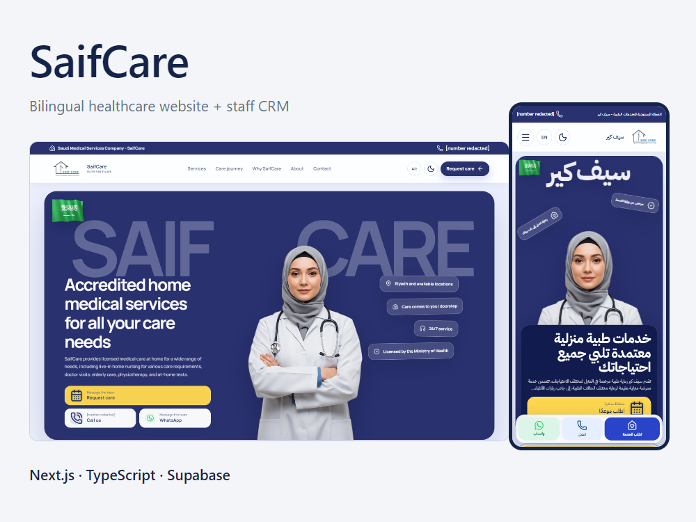
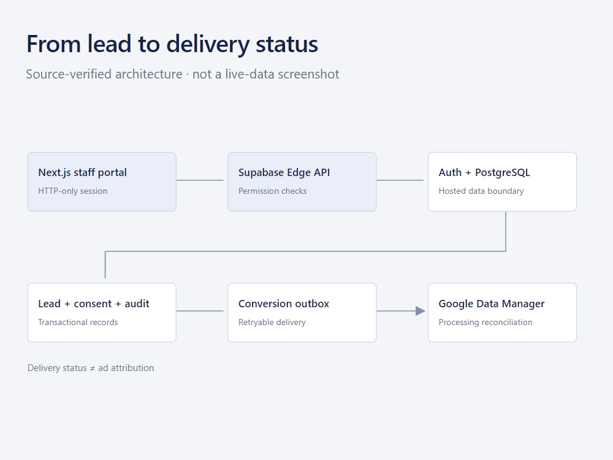
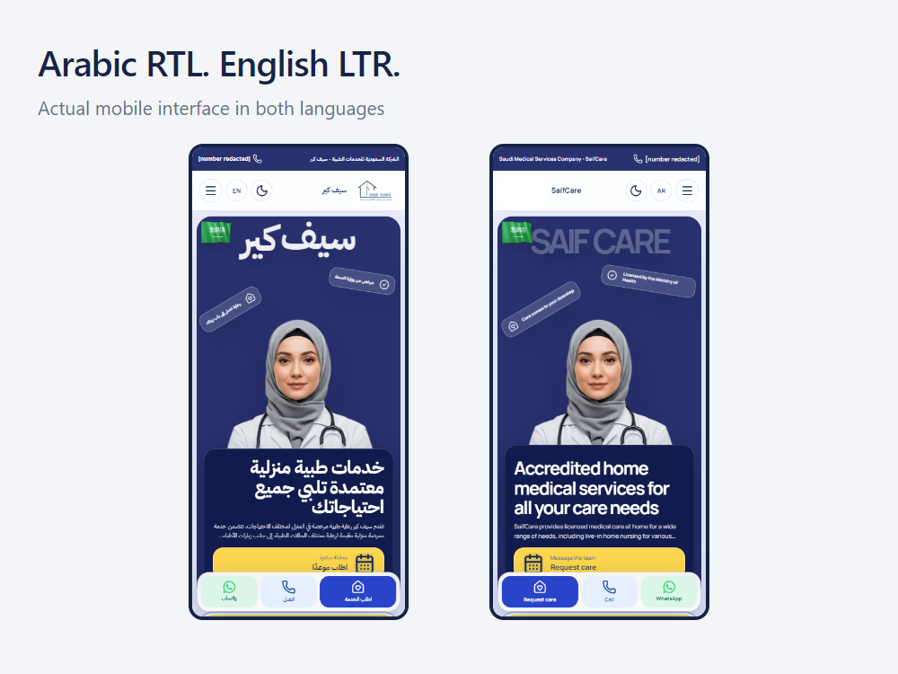
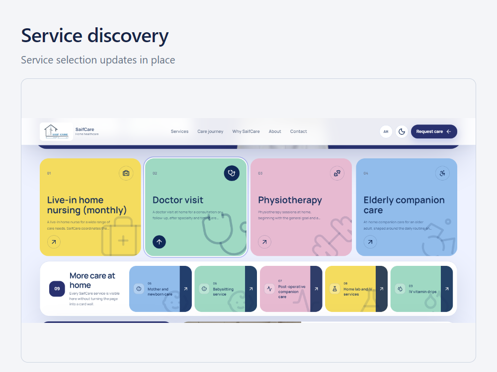
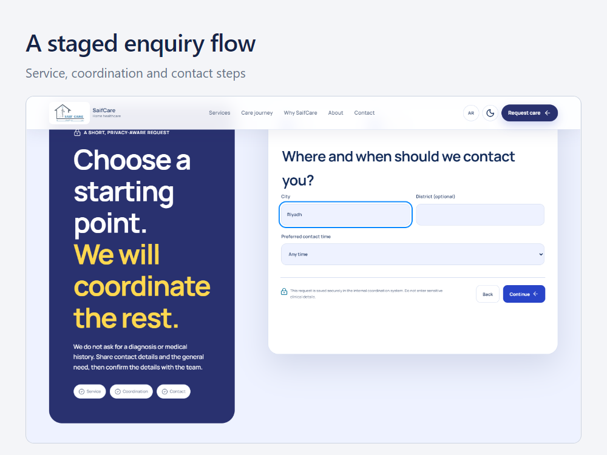
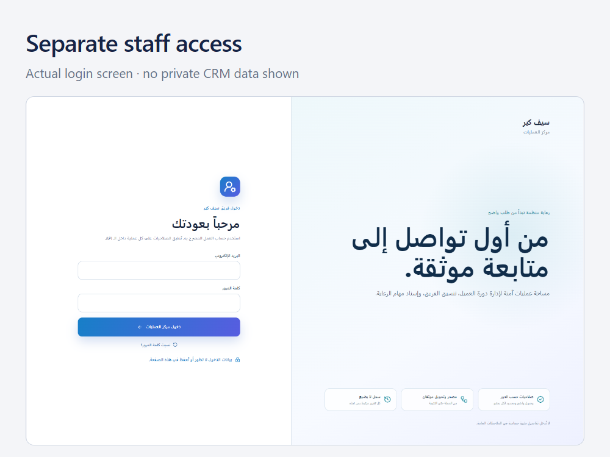

# SaifCare

An Arabic/English home-healthcare website with a separate staff CRM implementation.

## Work represented

The project combines a responsive public website with staff-side lead, follow-up
and reporting workflows. Shared contracts define input validation and allowed lead
transitions. Attribution is retained separately from the business event and its
delivery to an advertising provider.

- Arabic RTL and English LTR interfaces.
- Service discovery and a three-step enquiry form.
- Permission-based staff workflows and HTTP-only session handling.
- Lead attribution and consent-aware conversion records.
- Google Data Manager ingest and processing-status reconciliation.

## Implementation

Next.js, React and TypeScript applications share contracts and analytics helpers
in a pnpm/Turborepo monorepo. The public site uses static exports on Cloudflare.
The portal is configured for Cloudflare Workers through OpenNext. The hosted API
implementation uses Supabase Edge Functions, Auth and PostgreSQL.

Google acceptance, processing success and ad attribution are different states.
The integration code preserves that distinction instead of labeling every accepted
request as a successful advertising conversion.

## Demonstration and status

[Watch the 57-second product demo](media/saifcare_demo_1080p.mp4).

The video shows actual local website interactions and a source-verified backend
diagram. No patient records or private analytics are shown. The public website
was accessible when reviewed on 12 September 2026. The authenticated production
CRM and live provider delivery were not re-tested for this case study.

Fifty focused unit/invariant checks passed during preparation. This is not a claim
of complete end-to-end acceptance, a compliance certification or measured sales impact.

## Interface details

## Source availability

The application source is private. This repository is a case study, not an
open-source distribution of the healthcare platform. Screenshots show the product's
existing client content; they are not independent medical or licensing endorsements.
